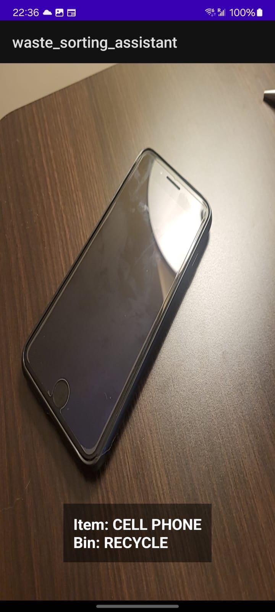

# WasteSorting-Real-Time-Object-Detection

## Overview

This project is a real-time object detection & classification system that can be used to sort waste into three categories: recyclable, compost and waste (NEU VAN), the current repository contains part of the entire project, which is written in Kotlin and tested mostly on Android devices.

## Demo preview (camera runs in real-time)

The resolution of the images are all distored due to the input requierment of the model, room of improvement. 




## Installation

### Prerequisites

- Android Studio
- Android SDK
- Android NDK
- Android device (USB debugging enabled, cable connected to the computer)

### Steps

1. Clone the repository

    ```bash
    gh repo clone haoniu08/WasteSorting-Real-Time-Object-Detection
    ```

2. Open the project in Android Studio

3. Build the project

4. Run the project on an Android device (device needs to be in developer mode)


## ML models considered, tested / used

- YOLO V5

    https://www.kaggle.com/models/kaggle/yolo-v5

- MobileNetV3

    https://www.kaggle.com/models/tensorflow/ssd-mobilenet-v1?select=variables

- MobileNetV1

    https://www.kaggle.com/models/tensorflow/ssd-mobilenet-v1?select=variables